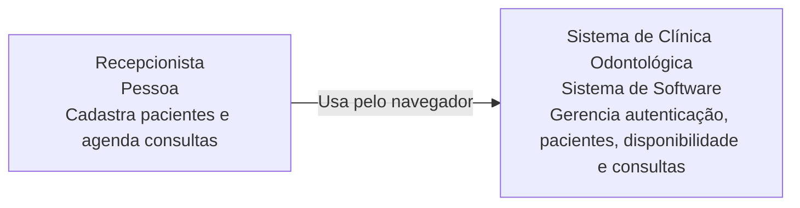
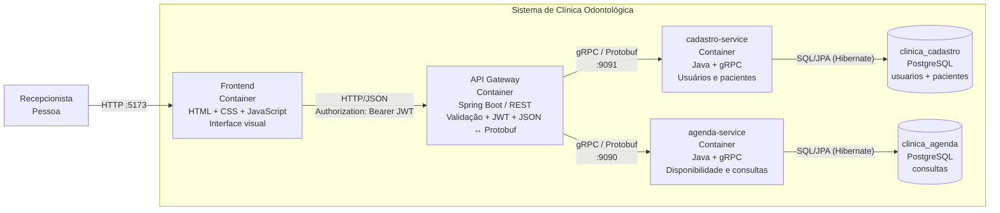
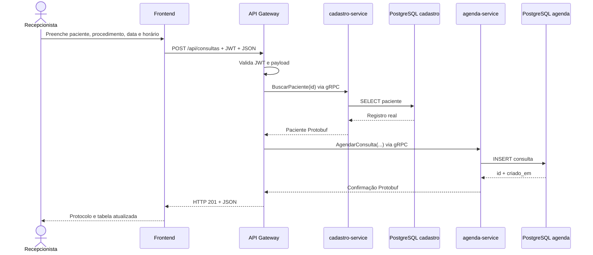

# Clínica Odontológica Distribuída — Trabalhos 1 e 2

Projeto da disciplina **Sistemas Distribuídos** para o domínio de uma clínica odontológica. O repositório começou no Trabalho 1 com comunicação gRPC entre recepção e agenda e foi evoluído no Trabalho 2 para uma aplicação web completa com **Frontend + API Gateway + JWT + dois microsserviços gRPC + PostgreSQL real**.

## Entregas

| Etapa | Data | Escopo |
| --- | --- | --- |
| **Trabalho 1** | 10/09/2026 | gRPC, Protocol Buffers, cliente/servidor e execução em GCP |
| **Trabalho 2** | 22/10/2026 | Frontend, API Gateway REST, JWT, 2 microsserviços gRPC e banco real |

Documentação complementar:

- [`docs/TRABALHO_1.md`](docs/TRABALHO_1.md)
- [`docs/TRABALHO_2.md`](docs/TRABALHO_2.md)
- [`docs/API.md`](docs/API.md)
- [`docs/ROTEIRO_APRESENTACAO_T2.md`](docs/ROTEIRO_APRESENTACAO_T2.md)

---

# Arquitetura atual — Trabalho 2

## C4 — Nível 1: Contexto



## C4 — Nível 2: Containers



**Regra arquitetural central:** o Frontend **nunca chama diretamente** `agenda-service` ou `cadastro-service`. Toda entrada externa passa pelo `api-gateway`.

## Fluxo dinâmico do agendamento



---

# Estrutura do repositório

```text
clinica-agendamento-grpc/
├── contratos-grpc/                 # agenda.proto + cadastro.proto e classes geradas
├── agenda-service/                 # microsserviço gRPC de agenda + PostgreSQL
├── cadastro-service/               # microsserviço gRPC de usuários/pacientes + PostgreSQL
├── api-gateway/                    # Spring Boot REST, validação, JWT e clientes gRPC
├── frontend/                       # interface web servida por Nginx
├── recepcao-service/               # cliente de terminal legado do Trabalho 1
├── infra/postgres/init/            # criação dos bancos lógicos
├── scripts/                        # testes de demonstração 400/401/201
├── docs/                           # documentação dos dois trabalhos e roteiro
├── docker-compose.yml
├── .env.example
└── pom.xml                         # Maven multi-módulo
```

| Módulo | Papel atual |
| --- | --- |
| `contratos-grpc` | Contratos Protobuf compartilhados |
| `api-gateway` | Único ponto HTTP externo; autentica, valida e orquestra gRPC |
| `cadastro-service` | Autenticação de usuários e CRUD necessário de pacientes |
| `agenda-service` | Disponibilidade, agendamento e listagem de consultas |
| `frontend` | Interface da recepção |
| `recepcao-service` | Legado do Trabalho 1 / cliente gRPC de terminal |

---

# Trabalho 1 — base do projeto

A primeira versão implementava:

```text
recepcao-service (cliente gRPC)
        |
        | gRPC :9090 / Protocol Buffers
        v
agenda-service (servidor gRPC)
        |
        v
agenda em memória
```

Os RPCs originais foram:

- `ConsultarDisponibilidade`
- `AgendarConsulta`

A agenda possuía os horários `09:00`, `10:00`, `11:00`, `14:00`, `15:00`, `16:00` e `17:00`, com os procedimentos `LIMPEZA`, `RESTAURACAO`, `CANAL`, `EXTRACAO` e `CLAREAMENTO`.

No Trabalho 1 o uso de memória era suficiente. **No Trabalho 2 isso foi removido da implementação ativa**, pois o novo enunciado exige persistência real.

A documentação histórica e a execução em GCP estão em [`docs/TRABALHO_1.md`](docs/TRABALHO_1.md).

---

# Trabalho 2 — implementação

## Frontend

Interface visual em `frontend/` com:

- login;
- cadastro de pacientes;
- consulta de disponibilidade;
- seleção de procedimento/data/horário;
- criação de consulta;
- listagem de consultas persistidas;
- botão demonstrativo para chamada protegida sem JWT e retorno `401`.

O código JavaScript aponta exclusivamente para o API Gateway na porta `8080`.

## API Gateway

Implementado com **Spring Boot** e **Spring Security**.

Responsabilidades:

1. receber HTTP/JSON;
2. validar DTOs com Jakarta Bean Validation;
3. bloquear rotas protegidas sem JWT;
4. converter dados JSON para mensagens Protobuf;
5. chamar os microsserviços por gRPC;
6. converter respostas Protobuf de volta para JSON;
7. devolver status HTTP semânticos.

## Microsserviço de Cadastro

`cadastro-service`, porta gRPC `9091`.

Responsabilidades:

- validar login em usuário armazenado no PostgreSQL;
- cadastrar paciente;
- buscar paciente;
- listar pacientes.

O usuário inicial de demonstração é criado **no banco** no primeiro start, com senha armazenada via **PBKDF2WithHmacSHA256**.

## Microsserviço de Agenda

`agenda-service`, porta gRPC `9090`.

Responsabilidades:

- consultar horários livres no banco;
- criar consulta;
- impedir colisão de `(data, horário)` por constraint no PostgreSQL;
- listar consultas persistidas.

Não existe `Map`/`List` em memória como fonte de verdade da agenda. Até a grade de horários de atendimento é lida da tabela `horarios_atendimento` no PostgreSQL.

## Bancos

Um container PostgreSQL hospeda dois bancos lógicos:

```text
clinica_cadastro
  ├── usuarios
  └── pacientes

clinica_agenda
  ├── horarios_atendimento
  └── consultas
```

A separação mantém os dados de cada microsserviço isolados, mesmo usando a mesma instância PostgreSQL no ambiente de demonstração.

Cada serviço agora é uma aplicação **Spring Boot** (sem `spring-boot-starter-web`, só `spring-boot-starter-data-jpa`) que sobe o contexto Spring e, dentro dele, inicia o servidor gRPC manualmente em `ServidorAgenda`/`ServidorCadastro`. As tabelas não são mais criadas por SQL manual: cada entidade JPA (`ConsultaEntity`, `HorarioAtendimento`, `PacienteEntity`, `Usuario`) cria/atualiza sua própria tabela via `spring.jpa.hibernate.ddl-auto=update`, e o acesso é feito por interfaces `JpaRepository` do Spring Data. Regras de negócio inválidas (dados de agendamento/paciente incorretos, horário já ocupado, CPF duplicado) são sinalizadas por classes de exceção dedicadas (`ConsultaInvalidaException`, `HorarioIndisponivelException`, `PacienteInvalidoException`, `PacienteJaExisteException`), validadas por `AgendamentoValidator`/`PacienteValidator` — o mesmo padrão de Entity + Validação + Exceção usado em projetos Spring Boot/JPA convencionais, adaptado para uma API gRPC.

A URL/usuário/senha do banco de cada serviço vêm de variáveis de ambiente (`AGENDA_DB_URL`/`CADASTRO_DB_URL` etc., ver `.env.example`). Por padrão local (`docker compose up` sem `.env`) cada serviço usa seu próprio banco lógico (`clinica_agenda`/`clinica_cadastro`) no container `postgres`, criados pelo script `infra/postgres/init/01-databases.sql`. O `.env` (não versionado) pode apontar as duas para qualquer instância PostgreSQL externa — inclusive uma já existente na nuvem com um único banco (ex.: `postgres`), caso em que os dois serviços compartilham a mesma base física: como as tabelas têm nomes diferentes (`usuarios`/`pacientes` vs. `horarios_atendimento`/`consultas`), não há colisão. O Hibernate só cria/atualiza tabelas (`ddl-auto=update`), nunca o banco em si — o banco de destino precisa existir de antemão.

---

# Contratos gRPC

## `agenda.proto`

| RPC | Responsabilidade |
| --- | --- |
| `ConsultarDisponibilidade` | Busca horários não ocupados no PostgreSQL |
| `AgendarConsulta` | Persiste uma consulta e devolve protocolo |
| `ListarConsultas` | Lista consultas persistidas |

## `cadastro.proto`

| RPC | Responsabilidade |
| --- | --- |
| `Autenticar` | Verifica usuário/senha no banco |
| `CadastrarPaciente` | Persiste paciente |
| `AtualizarPaciente` | Altera paciente com `UPDATE` real no PostgreSQL |
| `BuscarPaciente` | Consulta paciente por ID |
| `ListarPacientes` | Lista pacientes persistidos |

As classes Java geradas permanecem em `contratos-grpc/target/generated-sources/protobuf/` e não são versionadas.

---

# API REST

Base local: `http://localhost:8080`.

| Método | Endpoint | JWT | Sucesso |
| --- | --- | --- | --- |
| `POST` | `/auth/login` | Não | `200` |
| `GET` | `/health` | Não | `200` |
| `POST` | `/api/pacientes` | Sim | `201` |
| `GET` | `/api/pacientes` | Sim | `200` |
| `GET` | `/api/pacientes/{id}` | Sim | `200` |
| `PUT` | `/api/pacientes/{id}` | Sim | `200` |
| `GET` | `/api/agenda/disponibilidade?data=YYYY-MM-DD` | Sim | `200` |
| `POST` | `/api/consultas` | Sim | `201` |
| `GET` | `/api/consultas` | Sim | `200` |

Consulte exemplos em [`docs/API.md`](docs/API.md).

---

# Segurança JWT

Fluxo:

```text
POST /auth/login
      ↓
API Gateway
      ↓ gRPC
cadastro-service
      ↓ SQL
usuarios no PostgreSQL
      ↓
credenciais válidas
      ↓
Gateway gera JWT
      ↓
Authorization: Bearer <token>
```

As rotas `/api/**` exigem JWT válido. Uma chamada sem token é interrompida no Gateway e recebe:

```http
HTTP/1.1 401 Unauthorized
```

O token padrão expira em 120 minutos e pode ser configurado por variável de ambiente.

---

# Validação e status HTTP

O Gateway valida os campos obrigatórios antes de chamar o backend.

Exemplo inválido:

```json
{
  "nome": "Paciente sem CPF",
  "cpf": ""
}
```

Resposta:

```text
400 Bad Request
```

Casos demonstráveis:

| Caso | Status |
| --- | ---: |
| JWT ausente/inválido | `401 Unauthorized` |
| Payload obrigatório ausente/inválido | `400 Bad Request` |
| Login/listagem/disponibilidade | `200 OK` |
| Paciente criado | `201 Created` |
| Consulta criada | `201 Created` |
| Horário já ocupado | `409 Conflict` |
| Microsserviço indisponível | `503 Service Unavailable` |

---

# Como executar — recomendado

## Pré-requisitos

- Docker Desktop com Docker Compose.
- Portas locais livres: `5173`, `8080`, `9090`, `9091` e `5432`.

## 1. Subir a aplicação completa

Na raiz:

```bash
docker compose up --build
```

Ou em segundo plano:

```bash
docker compose up --build -d
```

## 2. Abrir o Frontend

```text
http://localhost:5173
```

Credenciais locais padrão:

```text
E-mail: admin@clinica.com
Senha: admin123
```

Essas credenciais são apenas para ambiente acadêmico/local e podem ser alteradas no `.env`.

## 3. Verificar Gateway

```bash
curl http://localhost:8080/health
```

## 4. Parar

```bash
docker compose down
```

Para apagar também os dados persistidos:

```bash
docker compose down -v
```

> O `-v` apaga o volume PostgreSQL e deve ser usado apenas quando você realmente quiser reinicializar os bancos.

---

# Comprovar persistência real

Os comandos abaixo assumem o container local `clinica-postgres` (padrão do `docker compose up`). Se o `.env` estiver apontando para uma instância externa/nuvem (`CADASTRO_DB_URL`/`AGENDA_DB_URL`), rode o mesmo `SELECT` com `psql -h <host> -U <user> -d <banco>` direto contra ela.

Depois de cadastrar um paciente no Frontend:

```bash
docker exec -it clinica-postgres psql -U postgres -d clinica_cadastro -c "SELECT id,nome,cpf,email,criado_em FROM pacientes ORDER BY id DESC LIMIT 10;"
```

Depois de agendar uma consulta:

```bash
docker exec -it clinica-postgres psql -U postgres -d clinica_agenda -c "SELECT id,protocolo,paciente_id,paciente_nome,procedimento,data,horario FROM consultas ORDER BY id DESC LIMIT 10;"
```

Para mostrar que o usuário de login também é real:

```bash
docker exec -it clinica-postgres psql -U postgres -d clinica_cadastro -c "SELECT id,nome,email,criado_em FROM usuarios;"
```

---

# Demonstração automática dos status

No Windows PowerShell:

```powershell
.\scripts\demo.ps1
```

O script demonstra:

1. `401` sem JWT;
2. login e obtenção do token;
3. `400` com payload inválido;
4. `201` ao persistir paciente;
5. disponibilidade consultada no serviço de agenda;
6. `201` ao persistir consulta;
7. listagem final vinda do banco.

No Linux/macOS há também:

```bash
./scripts/demo.sh
```

---

# Execução sem Docker

Também é possível executar Java localmente, desde que exista PostgreSQL com os bancos `clinica_cadastro` e `clinica_agenda`.

Compilar:

```bash
./mvnw clean install
```

Windows:

```powershell
.\mvnw.cmd clean install
```

Variáveis padrão dos bancos:

```text
CADASTRO_DB_URL=jdbc:postgresql://localhost:5432/clinica_cadastro
CADASTRO_DB_USER=postgres
CADASTRO_DB_PASSWORD=postgres

AGENDA_DB_URL=jdbc:postgresql://localhost:5432/clinica_agenda
AGENDA_DB_USER=postgres
AGENDA_DB_PASSWORD=postgres
```

Executar os microsserviços pelos JARs gerados:

```bash
java -jar cadastro-service/target/cadastro-service-2.0.0-SNAPSHOT.jar
java -jar agenda-service/target/agenda-service-2.0.0-SNAPSHOT.jar
java -jar api-gateway/target/api-gateway-2.0.0-SNAPSHOT.jar
```

Para o Frontend, sirva a pasta via HTTP. Exemplo:

```bash
python -m http.server 5173 --directory frontend
```

---

# Portas

| Componente | Porta | Protocolo |
| --- | ---: | --- |
| Frontend | `5173` | HTTP |
| API Gateway | `8080` | HTTP/JSON |
| agenda-service | `9090` | gRPC/Protobuf |
| cadastro-service | `9091` | gRPC/Protobuf |
| PostgreSQL | `5432` | TCP/PostgreSQL |

---

# Roteiro recomendado para a apresentação do Trabalho 2

Em até 10 minutos:

1. mostrar o diagrama C4 deste README;
2. abrir a interface;
3. demonstrar `401` sem JWT;
4. realizar login;
5. demonstrar `400` com payload inválido;
6. cadastrar paciente e mostrar `201`;
7. consultar disponibilidade;
8. agendar e mostrar `201`;
9. executar `SELECT` no PostgreSQL e provar a persistência;
10. mostrar rapidamente `*.proto`, filtro JWT, controller e as entidades/repositories JPA.

Roteiro detalhado: [`docs/ROTEIRO_APRESENTACAO_T2.md`](docs/ROTEIRO_APRESENTACAO_T2.md).

---

# Mapeamento dos requisitos do Trabalho 2

| Exigência | Onde está implementada |
| --- | --- |
| Interface visual | `frontend/` |
| Frontend só conversa com Gateway | `frontend/app.js` |
| API Gateway moderno | `api-gateway/` com Spring Boot |
| Mínimo de 2 microsserviços | `agenda-service` + `cadastro-service` |
| Comunicação gRPC | `AgendaGrpcClient` + `CadastroGrpcClient` |
| Protocol Buffers | `contratos-grpc/src/main/proto/` |
| Banco real | PostgreSQL (local via Docker Compose ou instância na nuvem, configurável por `.env`) |
| Inserção/consulta/alteração refletidas no banco | Entidades JPA + `JpaRepository` (Spring Data/Hibernate) em `AgendaRepository`/`CadastroRepository` |
| Sem mocks/listas em memória | persistência JPA/Hibernate nos dois serviços |
| Classes de criação de tabela, validação e exceção | `ConsultaEntity`/`PacienteEntity` (ddl-auto), `AgendamentoValidator`/`PacienteValidator`, `*Exception` |
| Validação de payload | DTOs + Jakarta Validation |
| 400 | `GlobalExceptionHandler` |
| 401 | Spring Security + JWT filter |
| 200/201 | controllers REST |
| Tradução JSON → Protobuf | clientes gRPC no Gateway |
| Persistência demonstrável | comandos `psql` acima |

---

# Trabalho 1 no Google Cloud

Na primeira entrega, o `agenda-service` era executado em uma VM do Compute Engine e o `recepcao-service` local se conectava pelo IP externo da VM.

Regra de firewall usada no T1:

| Campo | Valor |
| --- | --- |
| Nome | `trabalho-sd-grpc` |
| Direção | Entrada |
| Destino | Tag `trabalho-sd` |
| Intervalos de origem | `0.0.0.0/0` |
| Protocolos e portas | `tcp:8080,9090,50051` |

A VM precisava possuir a tag `trabalho-sd`. A preparação utilizada foi:

```bash
sudo apt update
sudo apt install -y git openjdk-21-jdk

git clone <URL_DO_REPOSITORIO>
cd clinica-agendamento-grpc
./mvnw clean install
```

Na VM:

```bash
./mvnw -pl agenda-service exec:java -Dexec.mainClass=clinica.agenda.ServidorAgenda
```

Na máquina local:

```powershell
.\mvnw.cmd -pl recepcao-service exec:java "-Dexec.mainClass=clinica.recepcao.ClienteRecepcao" "-Dexec.args=IP_EXTERNO_DA_VM 9090"
```

> Esses comandos registram a execução do Trabalho 1. Na implementação atual o `agenda-service` também depende do PostgreSQL, conforme a evolução exigida pelo Trabalho 2.

A arquitetura atual do Trabalho 2 é reproduzível localmente por Docker Compose. Os componentes também estão isolados em `Dockerfile`, facilitando uma publicação futura em GCP.

---

# Discentes — Grupo 05

| Integrante | Matrícula | Responsabilidade |
| --- | ---: | --- |
| Daniel Soares de Jesus | 202107006 | Desenvolvimento |
| Matheus Felipe Araújo de Moraes | 202204398 | Testes e validação |
| Murilo Bernardo | 202203524 | Testes e validação |
