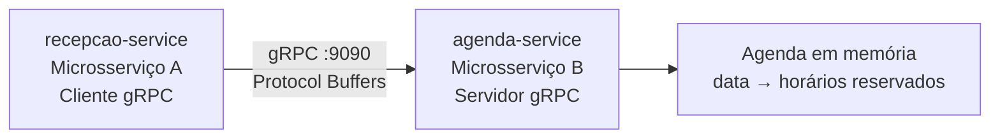

# Trabalho 1 — Agendamento de Consultas Odontológicas via gRPC

> Documento histórico da primeira etapa, apresentada em **10/09/2026**. A implementação atual foi evoluída para o Trabalho 2; o `recepcao-service` continua no repositório como cliente gRPC legado.

## Tema

Clínica odontológica. A recepção solicita o agendamento de consultas e o serviço de agenda decide se o horário pode ser confirmado, considerando a grade de atendimento e horários já reservados.

## Arquitetura original



| Módulo | Responsabilidade no Trabalho 1 |
| --- | --- |
| `contratos-grpc` | Contrato `agenda.proto` e classes geradas |
| `agenda-service` | Servidor gRPC; valida solicitações e mantinha a agenda |
| `recepcao-service` | Cliente gRPC de terminal |

## Contrato original

| RPC | Entrada | Saída |
| --- | --- | --- |
| `ConsultarDisponibilidade` | data | data e horários livres |
| `AgendarConsulta` | paciente, procedimento, data e horário | confirmação, protocolo, mensagem e alternativas |

Procedimentos: `LIMPEZA`, `RESTAURACAO`, `CANAL`, `EXTRACAO` e `CLAREAMENTO`.

## Regras originais

- Grade: 09:00, 10:00, 11:00, 14:00, 15:00, 16:00 e 17:00.
- Data em `dd/MM/aaaa`.
- Paciente e procedimento obrigatórios.
- Um horário ocupado não pode ser reservado novamente.
- Em caso de conflito, o servidor retorna horários alternativos.
- Na primeira entrega a agenda era reiniciada junto com o servidor, pois ainda era mantida em memória.

## Execução original

Compilação:

```bash
./mvnw clean install
```

Servidor:

```bash
./mvnw -pl agenda-service exec:java -Dexec.mainClass=clinica.agenda.ServidorAgenda
```

Cliente:

```bash
./mvnw -pl recepcao-service exec:java -Dexec.mainClass=clinica.recepcao.ClienteRecepcao
```

No Windows:

```powershell
.\mvnw.cmd -pl agenda-service exec:java "-Dexec.mainClass=clinica.agenda.ServidorAgenda"
.\mvnw.cmd -pl recepcao-service exec:java "-Dexec.mainClass=clinica.recepcao.ClienteRecepcao"
```

> Na versão atual, o `agenda-service` exige PostgreSQL porque foi evoluído para cumprir o Trabalho 2. Os comandos acima registram o formato de execução usado no T1.

## Host e porta

| Serviço | Argumentos | Padrão |
| --- | --- | --- |
| `agenda-service` | porta | `9090` |
| `recepcao-service` | host e porta | `localhost` e `9090` |

## Google Cloud Platform — configuração usada no T1

O servidor era executado em uma VM do Compute Engine e o cliente local se conectava ao IP externo da VM.

### Firewall VPC

| Campo | Valor |
| --- | --- |
| Nome | `trabalho-sd-grpc` |
| Direção | Entrada |
| Destino | Tag `trabalho-sd` |
| Origem | `0.0.0.0/0` |
| Portas | `tcp:8080,9090,50051` |

A VM precisava possuir a tag de rede `trabalho-sd`.

### Preparação histórica da VM

```bash
sudo apt update
sudo apt install -y git openjdk-21-jdk

git clone <URL_DO_REPOSITORIO>
cd clinica-agendamento-grpc
./mvnw clean install
```

Servidor na VM:

```bash
./mvnw -pl agenda-service exec:java -Dexec.mainClass=clinica.agenda.ServidorAgenda
```

Cliente local apontando para o IP externo:

```powershell
.\mvnw.cmd -pl recepcao-service exec:java "-Dexec.mainClass=clinica.recepcao.ClienteRecepcao" "-Dexec.args=IP_EXTERNO_DA_VM 9090"
```

## Demonstração do Trabalho 1

1. Consultar disponibilidade: todos os horários aparecem livres.
2. Agendar uma consulta: retorno `CONFIRMADO` com protocolo.
3. Consultar a mesma data: o horário reservado desaparece da lista.
4. Tentar o mesmo horário: retorno `RECUSADO` com alternativas.

## Evolução no Trabalho 2

- o armazenamento em memória foi substituído por PostgreSQL;
- a grade de atendimento também passou a ser consultada no banco;
- foi criado o `cadastro-service` como segundo microsserviço interno;
- o cliente principal deixou de ser terminal e passou a ser Frontend → API Gateway;
- autenticação JWT e validações HTTP passaram a acontecer no Gateway.
